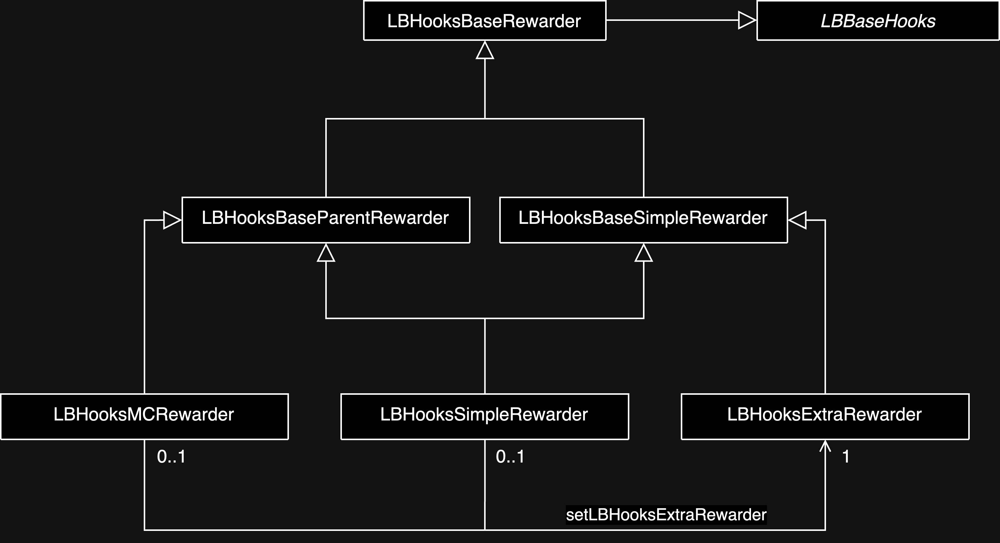

# LB Hooks Rewarder

This repository contains the smart contracts for the LB Hooks Rewarder.



## Contracts

### LBBaseHooks

The `LBBaseHooks` contract is the base contract for all hooks. It contains empty functions that can be overridden by the inheriting contracts to perform custom logic.

### LBHooksBaseRewarder

The `LBHooksBaseRewarder` contract is the base contract for all rewarders. It contains the logic for distributing rewards to users.

### LBHooksBaseParentRewarder

The `LBHooksBaseParentRewarder` contract is the base contract for all parent rewarders. It contains the logic to allow a secondary rewarder to distribute an additional reward to users.

### LBHooksBaseSimpleRewarder

The `LBHooksBaseSimpleRewarder` contract is the base contract for all rewarders that distribute rewards based on the `rewardsPerSecond`, `lastUpdateTimestamp`, and `endTimestamp` variables. It will distribute `rewardPerSecond` rewards per seconds if the `lastUpdateTimestamp` is smaller or equal to the current timestamp and the `endTimestamp` is greater or equal to the current timestamp.

### LBHooksSimpleRewarder

The `LBHooksSimpleRewarder` contract is a simple rewarder that distributes rewards based on the `rewardsPerSecond`, `lastUpdateTimestamp`, and `endTimestamp` variables. As it is also a Parent Rewarder, it can distribute additional rewards to users if an extra rewarder is set.

### LBHooksMCRewarder

The `LBHooksMCRewarder` contract is a rewarder that distributes rewards based on the amount of tokens he receives from a master chef contract. It will forward all the tokens received from the master chef to the users. As it is also a Parent Rewarder, it can distribute additional rewards to users if an extra rewarder is set.

### LBHooksExtraRewarder

The `LBHooksExtraRewarder` contract is a rewarder that distributes additional rewards to users based on the `rewardsPerSecond`, `lastUpdateTimestamp`, and `endTimestamp` variables. It will distribute `rewardPerSecond` rewards per seconds if the `lastUpdateTimestamp` is smaller or equal to the current timestamp and the `endTimestamp` is greater or equal to the current timestamp. It is expected to be used as a secondary rewarder by a parent rewarder.

## Foundry

**Foundry is a blazing fast, portable and modular toolkit for Ethereum application development written in Rust.**

Foundry consists of:

- **Forge**: Ethereum testing framework (like Truffle, Hardhat and DappTools).
- **Cast**: Swiss army knife for interacting with EVM smart contracts, sending transactions and getting chain data.
- **Anvil**: Local Ethereum node, akin to Ganache, Hardhat Network.
- **Chisel**: Fast, utilitarian, and verbose solidity REPL.

## Documentation

https://book.getfoundry.sh/

## Usage

### Build

```shell
$ forge build
```

### Test

```shell
$ forge test
```

### Format

```shell
$ forge fmt
```

### Gas Snapshots

```shell
$ forge snapshot
```

### Anvil

```shell
$ anvil
```

### Deploy

```shell
$ forge script script/Counter.s.sol:CounterScript --rpc-url <your_rpc_url> --private-key <your_private_key>
```

### Cast

```shell
$ cast <subcommand>
```

### Help

```shell
$ forge --help
$ anvil --help
$ cast --help
```
